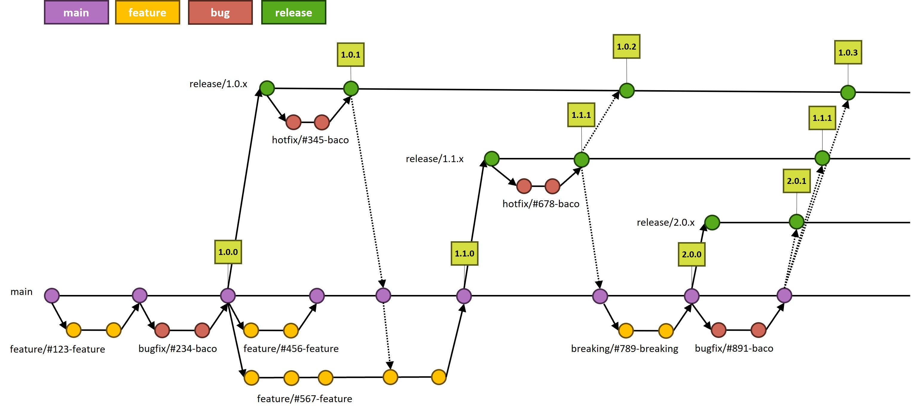

# Strategia di branching

Adottiamo la strategia **release flow** in cui i rami di lunga durata sono il **main** e **un ramo di release 
per ogni versione su cui diamo ancora supporto** (hotfix).

Lo sviluppo di **nuove feature** viene fatto su rami di breve durata a partire dal main. Anche la **risoluzione di
problemi** viene fatta su rami di breve durata che saranno basati sul main se si tratta di problemi insorti
durante lo sviluppo, mentre saranno basati su una release se si tratta di problemi su una versione in produzione.

## Ramo main
Il Ramo **main** contiene la versione instabile e dinamica del software.
Dal **main** si diramano **rami feature e bugfix** rispettivamente per lo sviluppo di feature e per la risoluzione di problemi durante lo sviluppo. I rami feature e bugfix:
* sono rami di **breve durata**
* 1 feature --> 1 ramo, 1 problema --> 1 ramo
* alla fine dello sviluppo si fa **merge nel main e si cancella il ramo**

Quando si arriva ad un insieme di funzioni e problemi risolti che possono essere introdotti nella release si **crea su main un tag con il numero di release e si crea ramo di release** su cui fare manutenzione.

Nei tag su main cambiano solo **il 1° e il 2° numero**.

## Rami di release
I rami **release** contengono le release attive in manutenzione (solo hotfix) e rimangono aperti fino a che si fa manutenzione su quella versione
* Si usano tag sul ramo release solo per release di hotfix quindi cambia solo il 3° numero.
* I problemi (hotfix) risolti su un ramo release vanno poi riportati (**cherry pick**):
    *  su tutte le altre release che hanno quel problema (sempre)
    *  sul ramo main (solo se il problema è stato risolto sull'**ultima release**)

## Nomenclatura
I **rami di breve durata** devono seguire la seguente nomenclatura: `<tipo>/#<numero issue>-<titolo issue>` dove tipo può essere:
* **Feature**: una nuova feature (si dirama sempre dal **main**)
* **Bugfix**: soluzione di problemi su sulla versione in sviluppo (si dirama sempre dal **main**)
* **Hotfix**: soluzione di problemi sulle versioni di produzione (si dirama sempre da una **release**)

I rami di **release** si nominano con il suffisso `release/` e aggiungendo .x ai primi due numeri di release (dal tag sul main), es: `release/1.0.x`